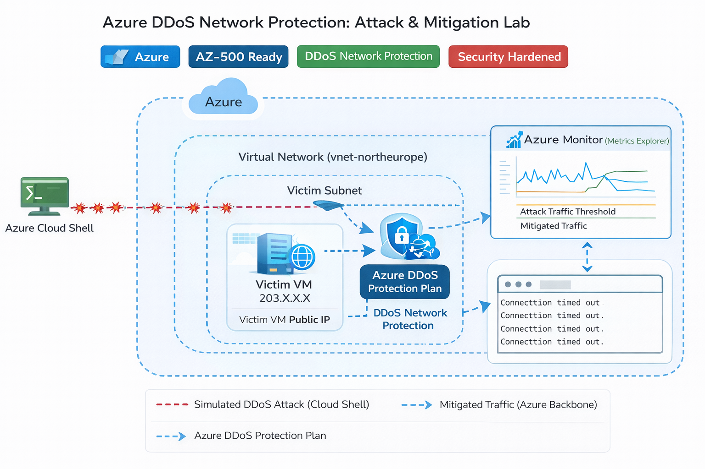
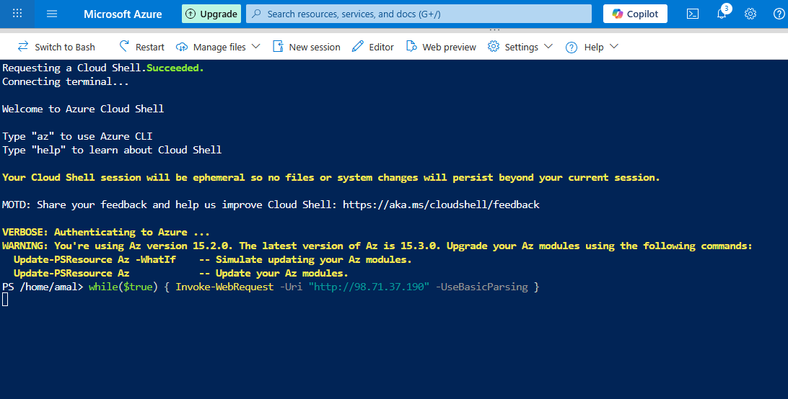
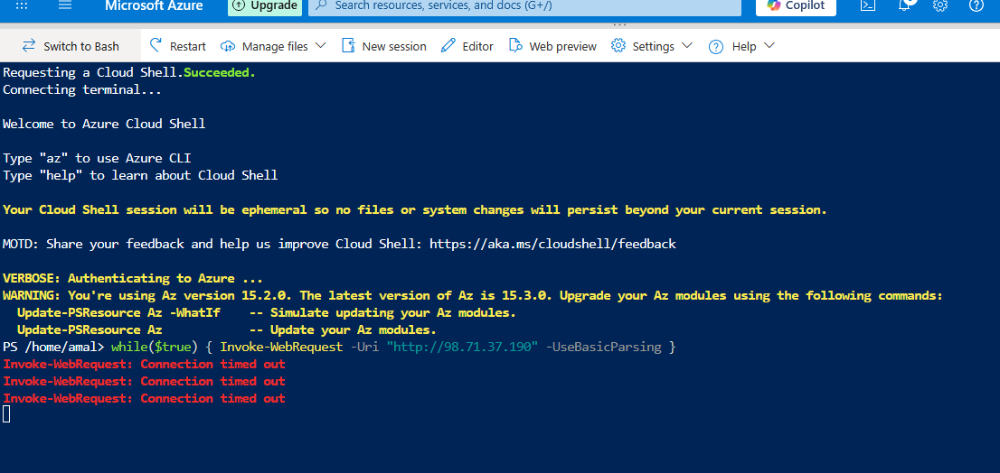

<p align="center">
  
  
  
</p>

<p align="center">
  
  
  
</p>


# 🚀 Azure DDoS Protection Lab – Enterprise Security Implementation

> Enterprise-grade Azure DDoS mitigation architecture with real attack simulation and monitoring validation.

<p align="center">
  
</p>


---

# 📌 Executive Overview

This lab demonstrates the design and implementation of **Azure DDoS Network Protection** to defend a public-facing virtual machine from volumetric Layer 3/4 attacks.

A simulated traffic flood was generated using Azure Cloud Shell, while Azure Monitor was used to validate real-time mitigation and attack detection.

### 🎯 Objective
Design a resilient network architecture capable of:

- Detecting abnormal traffic spikes
- Automatically mitigating volumetric attacks
- Preserving service availability
- Providing monitoring & telemetry visibility

---

# 🏗️ Enterprise Architecture Design

## 🔷 Architecture Components

| Component | Role |
|-----------|------|
| Virtual Network | Resource boundary |
| DDoS Protection Plan (Network Tier) | Advanced attack mitigation |
| Public IP | Internet-facing endpoint |
| Virtual Machine | Target workload |
| Azure Monitor | Detection & metrics |
| Cloud Shell | Controlled traffic simulation |

---

## 🔄 Traffic Protection Flow

1. Traffic enters via Public IP  
2. Azure edge network evaluates traffic baseline  
3. Abnormal spike detected  
4. Automatic mitigation activated  
5. Malicious packets dropped at edge  

---

# 🛡️ Threat Model

## 🔎 Identified Threat

**Volumetric DDoS Attack (Layer 3/4)**  
- SYN flood  
- UDP flood  
- High request burst  

## 🎯 Attack Impact Without Protection

- Service downtime  
- Resource exhaustion  
- Unexpected cost spikes  
- Reputation damage  

## 🛡️ Mitigation Strategy

- Azure DDoS Network Protection (Adaptive tuning)  
- Edge-level filtering  
- Traffic scrubbing  
- Real-time alerting  

---

# ⚖️ Basic vs Network Tier Comparison

| Feature | Basic | Network |
|----------|--------|---------|
| Enabled by default | ✅ | ❌ |
| Adaptive traffic tuning | ❌ | ✅ |
| Telemetry & Metrics | ❌ | ✅ |
| Attack mitigation logging | ❌ | ✅ |
| Cost protection guarantee | ❌ | ✅ |
| SLA | ❌ | ✅ |

**Conclusion:** Network Tier provides enterprise-grade visibility and automated mitigation.

---

# 💣 Attack Simulation

### PowerShell Traffic Script

```powershell
while($true) {
    Invoke-WebRequest -Uri "http://<Victim-Public-IP>" -UseBasicParsing
}
```

Multiple background jobs were launched to amplify request volume.

### Observed Results

- Azure Monitor flagged attack state  
- Under DDoS attack metric triggered  
- VM began rejecting excessive traffic  
- Timeouts confirmed mitigation  

---

# 📊 Monitoring & Detection

Metric Used:

```
Under DDoS attack or not
```

Aggregation:

```
Max
```

### Evidence of Mitigation

- Traffic spike detected  
- Attack state changed to TRUE  
- Excess traffic dropped  
- Service remained stable  

---

# 💰 Cost Awareness & Protection

Azure DDoS Network Protection includes:

- Cost protection policy  
- Scale-based mitigation  
- Billing safeguard during attack  

This prevents unexpected financial impact during large-scale attacks.

---

# 🔐 Security Best Practices Applied

- Public IP isolated within dedicated VNet  
- DDoS Plan linked at VNet level  
- Monitoring enabled before simulation  
- Cleanup performed after lab  
- Principle of least exposure  

---

# 🧹 Cleanup Procedure

```powershell
Get-Job | Stop-Job
Remove-AzResourceGroup -Name "AZ500-Lab-RG"
```

Ensures cost optimization after testing.

---

# 🎓 Certification Alignment

Aligned with Microsoft Certification Objectives:

- AZ-500: Secure Network Infrastructure  
- Implement Platform Protection  
- Monitor & Respond to Security Threats  

---

# 🧠 Key Technical Takeaways

- DDoS mitigation occurs at Azure global edge  
- Adaptive traffic baseline is automatically learned  
- Mitigation happens before traffic reaches VM  
- Monitoring visibility is critical for incident response  

---

# 🏢 Business Impact

This implementation demonstrates how enterprise cloud workloads can remain resilient under volumetric attack conditions while maintaining service continuity and cost control.

---

# 📈 Resume-Ready Achievements

• Designed and implemented Azure DDoS Network Protection architecture  
• Simulated volumetric attack and validated automated mitigation  
• Configured Azure Monitor to detect live attack metrics  
• Demonstrated secure cloud network architecture aligned with AZ-500  

---

## Screenshots Gallery

| Step | Screenshot | Description |
|------|------------|-------------|
| 1    |  | DDoS Protection Plan creation |
| 2    |  | VNet association with DDoS plan |
| 3    |  | PowerShell flood simulation |
| 4    |  | Attack detection & mitigation metrics |
| 5    |  | Connection timed out evidence |

---

## 👨‍💻 Author

**Amal U. Basnayake**  
Cloud Security | Azure Security | AZ-500 Focused  


🔗 GitHub: https://github.com/AmalUBasnayake  
🔗 LinkedIn: https://linkedin.com/in/amal-udayanga-basnayake
🔗 Medium: https://medium.com/@amalubasnayake

---

<p align="center">
⭐ If you found this project useful, give it a star!
</p>
